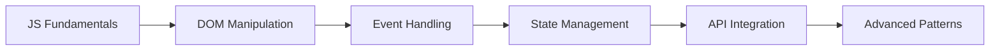

# 🚀 JavaScript Learning Path - From Fundamentals to Mastery

A comprehensive and curated collection of projects, exercises, and code samples documenting my journey to mastering Vanilla JavaScript. This repository serves as both my personal learning log and a public portfolio of my progress.

  
   
  
  
  
  
     
  

## 📚 About This Repository

This repository is the central hub for all my JavaScript learning materials. Each project is a self-contained application focused on practicing specific core concepts, with complexity increasing as my skills develop. The goal is to build a strong foundation in Vanilla JS before moving to frameworks.

## 🧩 Projects Portfolio

| Project                                                                               | Description                                                    | Core Concepts Practiced                                                  |
| :------------------------------------------------------------------------------------ | :------------------------------------------------------------- | :----------------------------------------------------------------------- |
| **[🧮 Counter App](https://github.com/AmirPhpDeveloper/vanilla-js-counter-practice)** | A feature-rich counter with persistence and keyboard controls. | `DOM Manipulation`, `Event Handling`, `localStorage`, `State Management` |
| **[💼 CorpComment](https://github.com/AmirPhpDeveloper/corp-comment-app)**            | A full-stack feedback board with API integration.              | `API Integration`, `ES6 Modules`, `Async JS`, `Form Validation`          |
| _More projects coming soon!_                                                          |                                                                |                                                                          |

## 🎯 Learning Roadmap

### 🔰 Foundation Level (Completed ✅)

- **Variables & Data Types**
- **Operators & Expressions**
- **Control Flow & Conditions**
- **Functions & Scope**
- **DOM Manipulation**
- **Event Handling**
- **Browser Storage**

### 🧩 Intermediate Level (In Progress 🚧)

- **API Integration (RESTful)**
- **ES6+ Features (Modules, Destructuring)**
- **Async/Await & Promises**
- **Advanced DOM Manipulation**
- **Form Validation**
- **Code Organization & Patterns**

### ⚡ Advanced Level (Planned 📅)

- **Modern JavaScript (ES2020+)**
- **Web Components**
- **Performance Optimization**
- **Testing (Jest)**
- **Build Tools (Webpack/Vite)**
- **Progressive Web Apps (PWA)**

## 📊 Progress Overview

## 🛠️ Technology Stack

- **Language:** Vanilla JavaScript (ES6+)
- **Styling:** Pure CSS3 (Flexbox, Grid, Animations)
- **Version Control:** Git & GitHub
- **Tools:** VS Code, Chrome DevTools

## 🏗️ Repository Philosophy & Approach

This is a **learning journal**, not a production codebase. The structure is organic and evolves daily as I explore new concepts. I prioritize **hands-on practice** over rigid organization.

### 🧭 Guiding Principles:

- **Project-Based Learning:** Each project is self-contained in its own folder
- **Progressive Complexity:** Projects get more advanced as skills develop
- **Practical Focus:** Building real applications, not just theory
- **Documentation:** Every project has its own README with demo and lessons learned

### 🔍 How to Navigate:

- Explore project folders to see practical implementations
- Check individual READMEs for demo GIFs and concept explanations
- Follow the commit history to see the learning journey timeline

## 🚀 How to Use This Repository

1.  **Explore Projects:** Each project folder is self-contained with its own README and demo.
2.  **Follow the Journey:** The projects are organized in order of complexity.
3.  **Learn from Code:** Feel free to examine the code and see the progression of skills.

## 🤝 Contributing & Feedback

While this is primarily a personal learning journal, suggestions and constructive feedback are always welcome! If you have ideas for projects or concepts I should explore, please open an issue.

## 📜 License

This learning repository is open source and available under the [MIT License](LICENSE).

---

**Happy Coding!** 🚀

_“The beautiful thing about learning is that nobody can take it away from you.”_ - B.B. King
